# Sequential HTTP Server, Networking Lab Part 2
## Mariana Malagón Tochoy

## Lab summary

Extend a socket-based Java server into a small sequential web application that serves
HTML, JavaScript and images, exposes a few hardcoded service URLs, and runs on a single
AWS EC2 instance.

The server is deliberately limited: it handles one connection at a time. The point of the
laboratory is to build a correct, observable baseline and understand where requests wait,
before introducing concurrency or distribution. Asynchronous JavaScript keeps the browser
responsive, but it does not make the server concurrent; moving to EC2 changes where the
process runs, but one instance is still one capacity limit.

**Course:** Enterprise Architecture, Escuela Colombiana de Ingeniería Julio Garavito

---

## System metaphor

The application works like **a single service counter at a public office**.

The browser is the person arriving with a form. The HTTP request line is the form itself:
it states what is wanted and where to deliver it. The path on that form is the counter it
is addressed to. Some counters hand over documents that were printed in advance, which are
the static resources: the page, the stylesheet, the script and the images. Other counters
have a clerk who works out an answer on the spot, which are the hardcoded services.

There is exactly one clerk. When someone arrives with a request that takes five minutes,
everybody behind them waits, no matter how trivial their own errand is. The queue is real
and it is visible in section 6.2.

| Component | Responsibility |
|---|---|
| Browser | Requests the page and every resource it references |
| `app.js` | Builds service URLs, sends requests asynchronously, updates only the affected part of the page |
| Security group | Instance-level firewall, allows only the ports the lab needs |
| `HttpServer` | Accepts one connection at a time, parses the request line, routes the path |
| `Response` | Carries status, content type and body as bytes to a single writing point |
| `Services` | Computes the dynamic answers and returns JSON |
| Public resources | Files served from inside the jar with their content type and length |

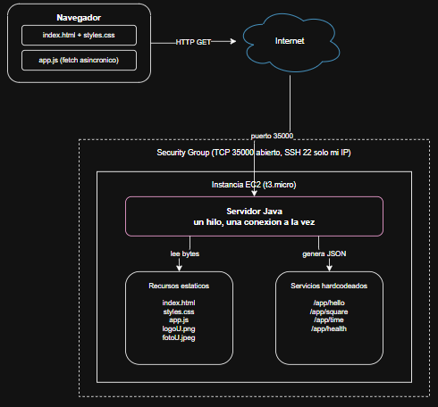

---

## Design decisions

**The server stays sequential.** A connection is handled completely before the next one is
accepted. There are no threads and no thread pool. This keeps the cost of a slow request
visible instead of hiding it, which is the behaviour the laboratory is meant to expose.

**Routing is hardcoded.** The requested path is compared against explicit conditions. A
framework, an annotation-based router or a dependency-injection container would hide the
mechanism being studied: that the path is what selects the behaviour.

**Every body is bytes.** Text and binary resources follow one response path. A JPEG placed
in a `String` would be interpreted as UTF-8 characters, invalid sequences would be replaced
and the image would arrive corrupted. Keeping bodies as byte arrays also makes the content
length exact.

**Unsafe paths are rejected before the file system is touched.** The path is URL-decoded
first, so an attack written as `%2e%2e` cannot slip past the check.

**The browser client is asynchronous.** The page issues requests without reloading, so the
interface stays responsive while a response is pending. That is a property of the client,
not of the server.

---

## Prerequisites

- Java 21 (JDK)
- Apache Maven 3.9 or later
- A web browser with developer tools

```bash
java -version
mvn -version
```

---

## Build and run locally

```bash
git clone https://github.com/marianamalagon11/TDSE_HttpServer.git
cd TDSE_HttpServer
mvn clean package
java -jar target/httpServer-1.0-SNAPSHOT.jar
```

The build compiles the sources, runs the test suite and produces the executable jar under
`target/`. The server listens on port 35000 by default. Open `http://localhost:35000/` in a
browser and stop the process with `Ctrl+C`.

To run on a different port, pass it as an argument or set the `PORT` environment variable:

```bash
java -jar target/httpServer-1.0-SNAPSHOT.jar 8080
```

---

## Progress by lab section

| Section | Status |
|---|---|
| 1. Purpose and boundaries | Defined |
| 2. Starting point: the minimal server | Done |
| 3. Serve HTML, JavaScript and images | Done |
| 4. Hardcoded service URLs | Done |
| 5. Asynchronous browser client | Done |
| 6. Integration and testing | Done |
| 7. Deployment to AWS EC2 | Done |
| 8. Final validation and reflection | Done |
| 9. Deliverables | Done |
| 10. AWS cleanup | Done |

---

### 1. Purpose and boundaries

**Scope.** Serve static resources with correct response metadata, recognise a small set of
hardcoded URLs that produce dynamic responses, and run the same application on one EC2
instance.

**Out of scope.** Threads, concurrent requests, thread pools, queues, load balancers,
autoscaling, containers, databases, authentication and production security. The server
processes one connection at a time.

**Prediction recorded before implementing (revisited in section 6.2).** While one user is
running a slow request, a second user's request will not be answered until the first one
finishes, because the server accepts a new connection only after closing the previous one.

---

### 2. Starting point: the minimal server

#### 2.1 Baseline verification

The server prints every line it receives, so the request line and headers sent by the
browser are visible in the console. A single page load produces more than one request:
besides the page itself, the browser asks for the favicon, and it would ask separately for
every script and image the page references.

The response is a status line, a content-type header, a blank line, and the body. The
blank line is what tells the client where the headers end.


#### 2.2 Accept multiple sequential requests

The connection loop was changed so the process keeps accepting connections after
completing each response. The listening socket stays open for the lifetime of the
process; the client socket and its streams are closed after every response, using
try-with-resources so they are released even when the request fails.

Each connection is handled completely before the next one begins. This is
**repetition, not concurrency**: there is a single thread of execution, and a second
connection waits in the operating system's accept queue until the current one is
done.

The server log makes this visible. Requests never interleave: the headers of one
request are always fully consumed and answered before the next request line appears.
Three page reloads produced fifteen consecutive requests answered by the same running
process, without restarting it. This also satisfies the "repeated requests" row of the
section 6.1 test matrix.


---

### 3. Serve HTML, JavaScript and images

The home page, the stylesheet, the client script and both images are now real files
under `src/main/resources/public`. The server reads every resource as bytes and
announces its content type from the file extension, so text and binary resources
follow one response path.

A single page request produces five separate HTTP requests: the browser reads the
HTML, discovers the references to the stylesheet, the script and the images, and
asks for each one individually.

| Resource | Status | Content type |
|---|---|---|
| `index.html` | 200 | `text/html; charset=utf-8` |
| `styles.css` | 200 | `text/css; charset=utf-8` |
| `app.js` | 200 | `application/javascript; charset=utf-8` |
| `logoU.png` | 200 | `image/png` |
| `fotoU.jpeg` | 200 | `image/jpeg` |


Content length is computed from the byte array rather than from the number of
characters. This matters because a single accented character takes two bytes in
UTF-8: counting characters would announce a size the client never receives, and the
browser would either truncate the body or wait for bytes that never arrive.

#### Controlled error responses

Requests that cannot be served produce an explicit status instead of a generic
answer:


Only `GET` is accepted for this laboratory, and a rejected method carries an `Allow`
header so the client knows what the server does support.

The traversal attempt is rejected before the file system is touched. The path is
URL-decoded first, so an attack written as `%2e%2e` cannot slip past the check, and
`pom.xml` is never disclosed. Backslashes and null bytes are rejected for the same
reason: the application is developed on Windows and deployed on Linux, and both
separators must be blocked to behave identically on either host.

---

### 4. Hardcoded service URLs

Four service paths are recognised with explicit conditions on the request path. There
is no routing framework, no annotations and no dependency injection: the mechanism
that selects behaviour stays visible, which is what this section of the lab is meant
to expose. Any path that is not one of these four is treated as a static resource.

| Path | Input | Success | Error |
|---|---|---|---|
| `/app/hello` | `name` in the query string | `200` with a JSON greeting | `400` when `name` is missing |
| `/app/square` | `n` in the query string | `200` with the input and its square | `400` when `n` is missing or not a number |
| `/app/time` | none | `200` with the current server time | |
| `/app/health` | none | `200` with a status flag | |

A fifth path, `/app/slow`, was added for the experiment in section 6.2. It is not part of
the required set.

All of them return `application/json`. None stores anything between requests:
every response is computed from the current request alone.


**Validation.** Query parameters are split on `&` and `=` before being URL-decoded,
not after: decoding first would turn a `%26` inside a value into a real separator and
split the parameter in the wrong place. A missing or non-numeric parameter produces a
client-error status rather than a successful response carrying an error message.

**Escaping.** User input is never inserted into JSON as-is. A name containing a quote
would close the string early and break the response, so quotes, backslashes, control
characters and angle brackets are escaped before the value is embedded.

The server time is returned in ISO-8601 with its offset, so the value is clearly
produced by the server rather than read from the browser clock.

---

### 5. Asynchronous browser client

The home page is the client interface. Every action is handled by `app.js`, which
builds the service URL, sends the request with the browser's asynchronous request API,
and updates only the relevant part of the page. The document is never reloaded: in the
network view the page, the stylesheet, the script and the images are requested once,
while each button click adds a single `fetch` entry.

**Interface.** A text field and an action for the greeting, a numeric field and an
action for the square, an action for the server time, a result area, and a separate
error area. Both areas can hold content at the same time, so an invalid request does
not erase the last successful result.


**Handling the three outcomes.** The client distinguishes a network failure from a
valid HTTP error response from a successful one, because they need different messages:

- The request never reaches a server, so no HTTP response exists, and the user is told
  the server could not be contacted.
- The request completes but the status indicates an error. This case needs an explicit
  check: `fetch` treats a `400` as a completed request and does not raise, so reading
  the body without checking the status first would display `undefined` instead of the
  problem. The status is verified before the body is interpreted, and the `error`
  field returned by the service is shown as the message.
- The request succeeds and the JSON values update the result area.

**Loading state.** Buttons are disabled and the result area announces that a response
is pending, so the interface visibly reacts while the request is in flight. The state
is always restored, including when the request fails.

**Input validation happens twice.** Empty fields are caught in the browser before any
request is sent, and the server independently rejects missing or non-numeric
parameters. Client-side checks are a convenience, not a guarantee: a request can reach
the server without passing through the page at all, so the service validates on its
own.


Values are URL-encoded before being placed in the query string, which is the
counterpart of the decoding performed by the server. Responses are written into the
page as text rather than as markup, so a value coming back from the server is never
interpreted as HTML.

---

### 6. Integration and testing

#### 6.1 Functional test matrix

| Test | Expected observation | Result | Evidence |
|---|---|---|---|
| Load home page | HTML, JavaScript and images all load successfully | Five requests, all 200, correct content types | Section 3 |
| Valid greeting | The result area changes without a page reload | Result area updated, document not re-requested | Section 5 |
| Valid number | The correct square is presented | `7` returns `49` | Section 4 |
| Invalid number | A controlled client-error response becomes a friendly message | `400` shown as "'n' debe ser un numero" | Section 5 |
| Server time | The value comes from the server rather than the browser clock | ISO-8601 value with server offset | Section 4 |
| Missing static file | The server returns a not-found response | `404` with an HTML error page | Section 3 |
| Unsupported method | The server returns a method-not-allowed response | `405` with `Allow: GET` | Section 3 |
| Path traversal attempt | The request is rejected and no external file is disclosed | `403`, `pom.xml` not returned | Section 3 |
| Repeated requests | At least ten consecutive operations succeed in one server run | Fifteen consecutive requests across three reloads | Section 2.2 |

#### 6.2 Observing the sequential limitation

The prediction recorded in section 1 was that a second user would wait while the
first one runs a slow request. The experiment confirms it.

A deliberately slow service was added for this purpose. One window requested it; two
seconds later, a second window requested the server time, an operation that normally
completes in about six milliseconds.

| Window | Request | Time |
|---|---|---|
| 1 | `/app/slow?seconds=5` | 5.03 s |
| 2 | `/app/time` | 3.09 s |

While the slow request was in flight, the second window's request sat in `(pending)`
state. It completed only once the first one finished, and the timestamps show how
tightly the two are coupled:

| Response | Timestamp |
|---|---|
| Slow request finished | `2026-09-07T21:17:27.2167702-05:00` |
| Server time answered | `2026-09-07T21:17:27.2247599-05:00` |

Eight milliseconds apart. The second window was not waiting for the clock to be read;
it was waiting for its turn.


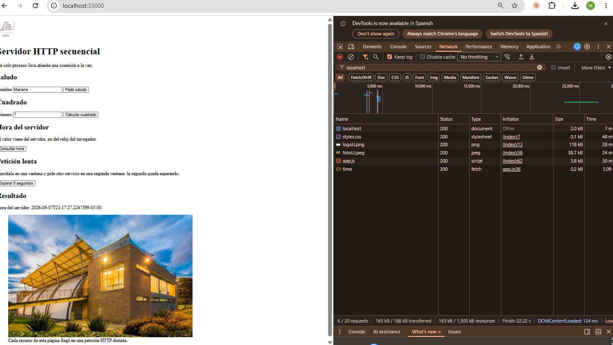

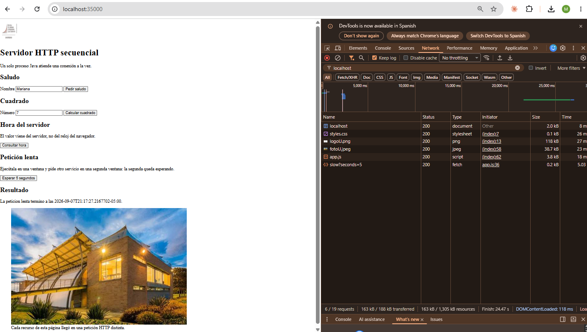

**Asynchronous client, non-concurrent server.** These are two different properties and
they are easy to confuse. The second window never froze: its page stayed interactive
and its buttons reacted, because `await` does not block the browser. But the server is
a single thread inside a loop, and that thread was held by the first request. It does
not return to accepting connections until the current response is written. The second
connection had already been established by the operating system and was sitting in the
socket's accept queue with nobody to read it.

Asynchronous JavaScript improves what the user sees while waiting. It does not change
how many requests the server can handle at once.

---

### 7. Deployment

#### 7.1 Preparing the application

The build produces a single executable artifact under `target/`. The public
resources live in `src/main/resources`, so the HTML, the stylesheet, the client
script and both images are packaged inside the jar: deployment is one file to
transfer, with nothing to keep in sync alongside it.

**Configurable port.** The listening port is taken from the first command-line
argument, then from the `PORT` environment variable, and falls back to 35000 if
neither is set. Running the same artifact twice on different ports confirms it:

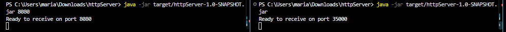

Both instances serve the full application, images and stylesheet included, which
verifies that the resources are read from inside the jar rather than from the
project directory:

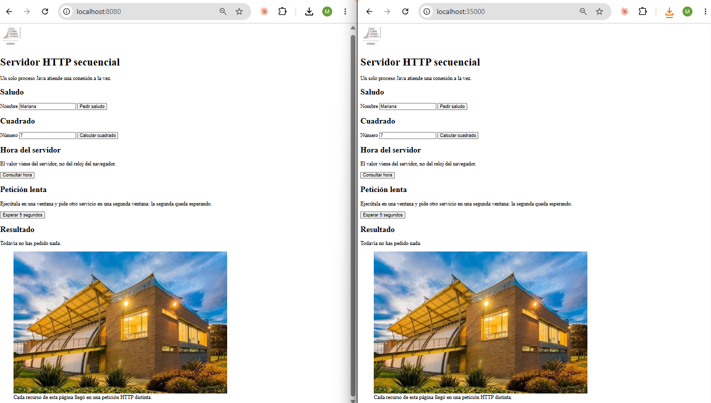

**Remote connections.** The server socket is created without binding to a specific
address, so it listens on all interfaces rather than only on the loopback address.
This is what allows the application to be reached from outside once it runs remotely.

**Runtime required:** Java 21. The packaged artifact was tested locally before being
uploaded.

#### 7.2 Security group

The instance firewall exposes only what the laboratory needs: the application port,
and administrative access restricted to a single address.

| Type | Port | Source | Purpose |
|---|---|---|---|
| Custom TCP | 35000 | Anywhere-IPv4 | Application traffic for the classroom test |
| SSH | 22 | My IP only | Administrative access |

SSH is deliberately not open to every address: port 35000 serves a public web page,
while port 22 grants administrative access to the machine.

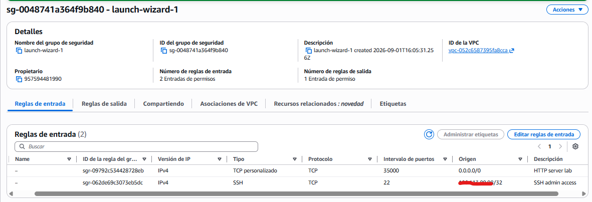

#### 7.3 Install and start

The Java runtime was installed on the instance with the distribution's package
manager:

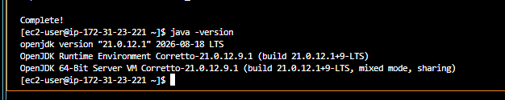

The artifact was transferred over SSH with `scp`, and the health service was verified
from **inside** the instance before testing from the browser. Checking locally first
separates an application problem from a network problem:

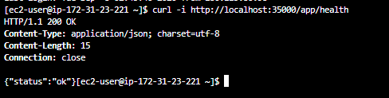

The application then answered on the instance's public address. All five static
resources and all four services respond correctly:

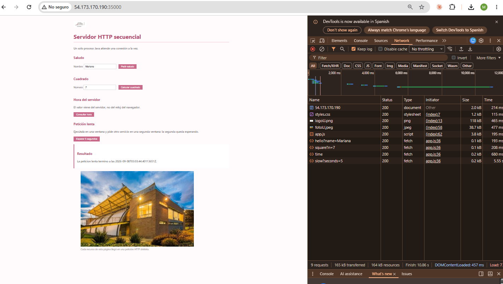

**What changed and what did not.** Response times went from tens of milliseconds
locally to hundreds remotely, which is the cost of the round trip between the client
and the region, not of the server itself. The slow service still takes just over five
seconds and still blocks every other request while it runs. The host changed; the
architecture did not.

#### 7.4 Running after logout

The application is managed by the operating system's service manager rather than
started by hand. The unit sets the port through the `PORT` environment variable,
restarts the process if it fails, and appends output to a known log file.

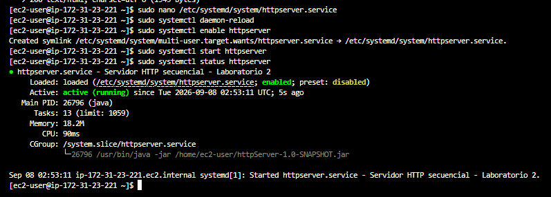

This was verified rather than assumed: the SSH session was closed and the application
kept answering.

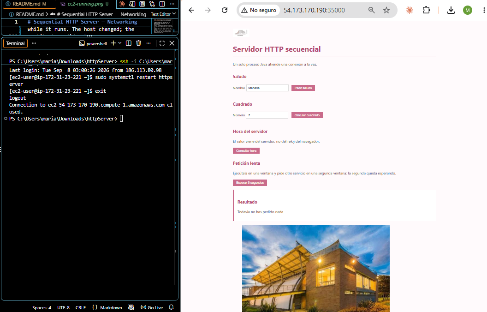

Logs are written to a fixed location and can be inspected at any time:

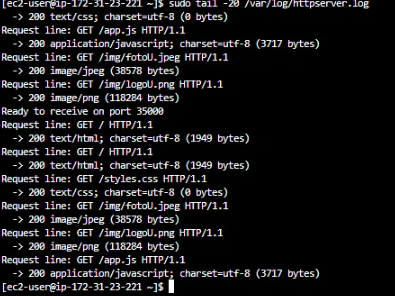

---

### 8. Final validation and reflection

#### 8.1 Acceptance checklist

- [x] The server handles multiple consecutive requests without restarting.
- [x] HTML, JavaScript, PNG and JPEG resources have correct response types and lengths.
- [x] Missing, invalid, unsafe and unsupported requests return controlled errors.
- [x] The browser invokes the special URLs asynchronously and does not reload the page.
- [x] The server remains sequential; no thread or concurrent-execution mechanism was added.
- [x] The packaged application works locally and on one EC2 instance.
- [x] The security group exposes only the administration and application ports needed.
- [x] No secret, private key or credential is stored in the repository.

#### 8.2 Discussion questions

**1. Why does a single HTML page cause several HTTP requests?**

Because the HTML only describes the page, it does not contain it. When the browser parses
the document it finds references to a stylesheet, a script and two images, and each of
those is a separate resource with its own address. It has no way to know they exist until
it has read the HTML, so it asks for them afterwards, one request each. The network view in
section 3 shows five requests for what looks like one page.

**2. Why must image responses be treated as bytes rather than text?**

A PNG or a JPEG is a compressed binary format, not a sequence of characters. Putting those
bytes into a Java `String` makes the runtime interpret them as UTF-8, and any sequence that
is not valid UTF-8 gets replaced by a substitute character. The bytes that come out are not
the bytes that went in, and the browser cannot decode the image. Reading everything as a
byte array also means the content length is the real size rather than a character count,
which differs for any accented text.

**3. What is the role of the response content type?**

It tells the client how to interpret the bytes it just received. The same sequence can be
rendered as a page, executed as code or decoded as an image depending only on that header.
The browser does not guess. Announcing the stylesheet as `text/html` would deliver the file
intact and the page would still appear unstyled, because the browser would refuse to treat
it as CSS.

**4. What is hardcoded in this design, and what would a routing framework eventually
generalise?**

The association between a path and the code that answers it. Every service is an explicit
condition on an exact string, and adding one means editing the routing method. A framework
would generalise three things: the matching itself, including path parameters and wildcards
instead of exact equality; the binding of query parameters to method arguments, which is
done by hand here; and the registration of handlers, so that new endpoints declare
themselves rather than being added to a central switch. All of that is useful and all of it
would hide the mechanism this laboratory is about.

**5. Why can the browser remain responsive while the server still handles requests
sequentially?**

Because they are different processes on different machines, and responsiveness is a
property of the client. When the page issues a request it does not block: it registers what
to do when the answer arrives and returns control to the browser, which keeps rendering and
reacting to input. Meanwhile the server is a single thread in a loop; it can only be inside
one request at a time. Section 6.2 shows both at once: the second window stayed usable and
still waited three seconds for its answer.

**6. What changed when the server moved to EC2? What did not change?**

What changed is where the process runs and how it is reached: a different host, a public
address, a firewall in front of it, a service manager keeping it alive, and round-trip
times ten times larger because the packets travel to another country. What did not change
is the application. The same jar, the same single thread, the same one connection at a
time. The slow service still blocks everything behind it exactly as it did locally.
Deploying to the cloud moved the boundary; it did not alter the architecture or raise the
capacity limit.

**7. What happens when two users send slow requests at almost the same time?**

They queue. The first connection is accepted and held for the whole duration of its work.
The second one is established by the operating system and parked in the accept queue with
nobody reading it, so its user waits the first request plus their own. With three users the
last one waits three times over. The delay grows with the number of people rather than
staying constant, and if the queue fills up, new connections are refused outright.

**8. What is the next architectural limitation you would address, and why should
concurrency come before load balancing?**

Concurrency, so that one process can work on several requests at once instead of one.
Right now the machine is idle for most of a slow request: the thread is waiting, not
computing, while the CPU has nothing to do. That is wasted capacity inside a single server.

Load balancing should come after, because a balancer multiplies servers, it does not fix
them. Putting one in front of processes that each handle a single request at a time buys
capacity at the price of a whole extra machine per concurrent user, and it duplicates a
bottleneck instead of removing it. The right order is to make one server use its own
resources well, measure what it can actually sustain, and only then decide how many of them
are needed. Distribution also brings its own problems, such as shared state and session
affinity, which are cheaper to face once the single-node behaviour is understood.

---

### 9. Deliverables

#### 9.1 Repository

Public GitHub repository using Maven as its build and dependency-management tool, with
the conventional source layout and small, meaningful commits showing the evolution from
the minimal server to the deployed application.

```
.
├── pom.xml
├── README.md
├── .gitignore
├── docs/                            # evidence screenshots
└── src
    ├── main
    │   ├── java/co/edu/escuelaing/httpserver/httpserver/
    │   │   ├── HttpServer.java      # connection loop, request parsing, routing
    │   │   ├── Response.java        # status, content type and body as bytes
    │   │   ├── Services.java        # the hardcoded services
    │   │   ├── EchoServer.java      # socket exercise from part 1
    │   │   ├── EchoClient.java      # socket exercise from part 1
    │   │   ├── ReadURL.java         # URL inspection exercise
    │   │   └── URLReader.java       # reading a page and its response headers
    │   └── resources/public/        # HTML, CSS, JavaScript and images
    └── test/java/co/edu/escuelaing/httpserver/httpserver/
        ├── HttpServerTest.java
        └── ServicesTest.java
```

Application code, tests and public resources are kept in separate trees. Nothing under
`target/` is committed: the artifact is rebuilt from source.

#### 9.2 Automated tests

Tests live under `src/test/java`, separate from the application source, and run as part
of the build:

```
mvn test
```

None of them opens a socket. They exercise the decisions the server makes: which content
type is assigned, which paths are rejected, how the query string is split, what each
service returns for valid and invalid input, without starting the server, so they run in
milliseconds and do not depend on a free port.

| Class | Covers |
|---|---|
| `HttpServerTest` | Content type selection, path safety, query string parsing, 200/403/404 responses |
| `ServicesTest` | Greeting, square, health, JSON escaping, and the client-error path of each service |

This is what separating the services from the networking code buys: if every response
were written straight to the socket, none of it could be verified without a running
server.

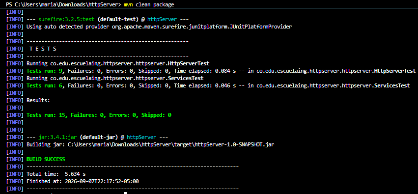

#### 9.3 .gitignore

The repository excludes Maven build output, compiled class files, IDE configuration
(both NetBeans and VS Code, since the project moved between them), operating-system
metadata, logs, environment files, private keys and local cloud configuration.

Two entries matter most here. `target/` holds the compiled classes and the jar, all of
which are regenerated by `mvn package` and have no reason to travel in the repository.
`*.pem` is the extension of the private key used to reach the instance over SSH: a key
committed to a public repository gives anyone who clones it administrative access to the
machine.

The history was inspected before submission to confirm that none of these, and no
secret, token or credential, was ever committed:

```
git ls-files
```

Adding a secret to `.gitignore` after committing it does not remove it from the
history, so the check was run against the tracked files rather than the working
directory.

---

### 10. AWS cleanup

Cleanup is part of the laboratory: a forgotten instance keeps generating charges even when
nobody is using it.

- The application was stopped and only the logs and screenshots needed for submission were
  kept.
- The EC2 instance was terminated and its state verified as `terminated`.
- No Elastic IP was created, so none had to be released.
- The laboratory security group was deleted once the instance no longer used it.
- The cost view in the learner account was checked afterwards.

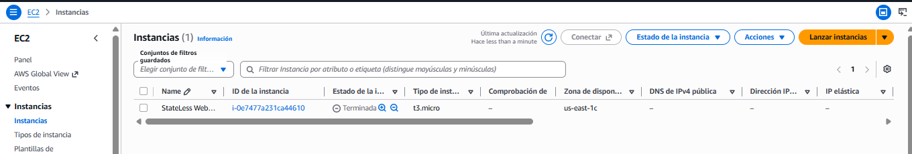

---

## Preliminary exercises from part 1

| Class | What it does |
|---|---|
| `ReadURL` | Prints protocol, authority, host, port, path, query and file of a URL |
| `URLReader` | Reads a remote page and prints its HTTP response headers |
| `EchoServer` / `EchoClient` | Echo protocol over raw TCP sockets |

```bash
java -cp target/classes co.edu.escuelaing.httpserver.httpserver.ReadURL
java -cp target/classes co.edu.escuelaing.httpserver.httpserver.URLReader
java -cp target/classes co.edu.escuelaing.httpserver.httpserver.EchoServer
java -cp target/classes co.edu.escuelaing.httpserver.httpserver.EchoClient
```

---

## Known limitations

- The server is **sequential**: one connection is handled at a time. A slow request
  blocks every other client, as demonstrated in section 6.2.
- Only the `GET` method is supported.
- Routing is limited to a small, hardcoded set of paths. There is no general routing
  mechanism.
- Responses are not compressed, not cached and not chunked; every response closes its
  connection.
- There is no persistence, no session state, no authentication and no TLS: the
  deployed application is served over plain HTTP.
- This is a teaching exercise, **not a production-ready HTTP server**.

---

## Acknowledgements

- Course material and code examples by Luis Daniel Benavides Navarro, Escuela Colombiana
  de Ingeniería.
- Java networking tutorials at `docs.oracle.com/javase/tutorial/networking`.
- AWS documentation on launching EC2 instances, connecting to instances and configuring
  security groups.