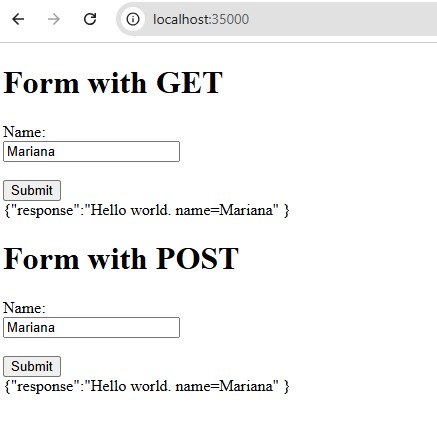
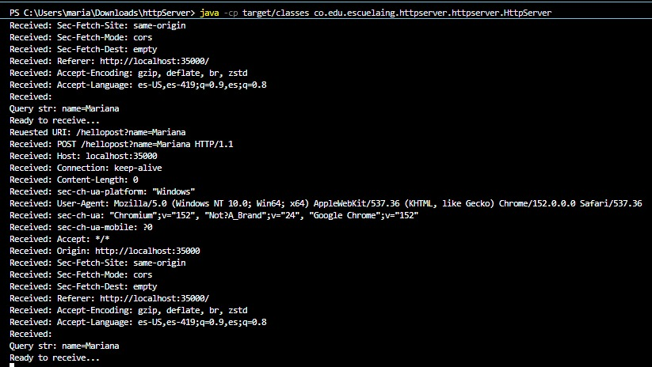

# Sequential HTTP Server — Networking Lab, Part 2
## Mariana Malagón Tochoy

## Lab summary

Extend a socket-based Java server into a small sequential web application that serves
HTML, JavaScript and images, exposes a few hardcoded service URLs, and runs on a single
AWS EC2 instance.

The server is deliberately limited: it handles one connection at a time. The point of the
laboratory is to build a correct, observable baseline and understand where requests wait,
before introducing concurrency or distribution. Asynchronous JavaScript keeps the browser
responsive, but it does not make the server concurrent; moving to EC2 changes where the
process runs, but one instance is still one capacity limit.


---

## Progress by lab section

### 1. Purpose and boundaries

**Scope.** Serve static resources with correct response metadata, recognise a small set of
hardcoded URLs that produce dynamic responses, and run the same application on one EC2
instance.

**Out of scope.** Threads, concurrent requests, thread pools, queues, load balancers,
autoscaling, containers, databases, authentication and production security. The server
processes one connection at a time.

**Prediction recorded before implementing (revisited in section 6.2).** While one user is
running a slow request, a second user's request will not be answered until the first one
finishes, because the server accepts a new connection only after closing the previous one.

---

### 2. Starting point: the minimal server

#### 2.1 Baseline verification

The server prints every line it receives, so the request line and headers sent by the
browser are visible in the console. A single page load produces more than one request:
besides the page itself, the browser asks for the favicon, and it would ask separately for
every script and image the page references.

The response is a status line, a content-type header, a blank line, and the body. The
blank line is what tells the client where the headers end.




#### 2.2 Accept multiple sequential requests

The connection loop was changed so the process keeps accepting connections after
completing each response. The listening socket stays open for the lifetime of the process;
the client socket and its streams are closed after every response.

Each connection is handled completely before the next one begins. This is **repetition,
not concurrency**: there is a single thread of execution, and a second connection simply
waits in the operating system's accept queue until the first one is done.


---

### 3. Serve HTML, JavaScript and images

**Pending.** The home page is currently a string literal inside the Java source. It has to
move to a public-resources area and be read from disk as bytes, with the content type
derived from the file extension and the content length computed from the actual byte
count.

---

### 4. Hardcoded service URLs

**Partial.** One special path is recognised so far:

| Path | Input | Current response |
|---|---|---|
| `/hello` | a query string | a JSON body echoing the query string |

Routing is a chain of explicit conditions on the request path, with no framework and no
annotation-based dispatcher, which is what the lab asks for: the mechanism that selects
behaviour stays visible.

Still missing: the square, server-time and health services; parsing the individual query
parameter instead of echoing the whole query string; the JSON content type; client-error
responses for missing or invalid parameters; and escaping untrusted values.

---

### 5. Asynchronous browser client

**Partial.** The page already sends requests without reloading, using the browser's
asynchronous request API, and updates only the result area.

Still missing: moving the script to its own JavaScript file, a numeric field and a
server-time action, a dedicated error area, checking the HTTP status before reading the
body, a visible loading state, and handling a network failure separately from a valid HTTP
error response.

---

### 6. Integration and testing

**Pending.** Functional test matrix and the two-window experiment that shows the second
request waiting for the first one to finish.

---

### 7. Deployment to AWS EC2

**Instance launched.** One `t3.micro` Linux instance is running in `us-east-1`, in the
default VPC, with a descriptive name tag.

Still pending: producing a deployable artifact, making the listening port configurable,
adding the security-group inbound rule for the application port, installing the Java
runtime, transferring the artifact, and running it as a managed background service.

**Evidence:** `docs/…` — EC2 console showing the running instance. Account identifier and
user name redacted.

---

### 8. Final validation and reflection

**Pending.** Acceptance checklist and answers to the eight discussion questions.

---

### 9. Deliverables

#### 9.1 Repository

Public GitHub repository using Maven, with the conventional source layout and small,
meaningful commits showing the evolution from the minimal server onward.
.
├── pom.xml
├── README.md
├── .gitignore
└── src
└── main
└── java/co/edu/escuelaing/httpserver/httpserver/
├── HttpServer.java # connection loop, request parsing, responses
├── EchoServer.java # socket exercise: returns the message received
├── EchoClient.java # socket exercise: sends messages from the keyboard
├── ReadURL.java # prints the components of a URL
└── URLReader.java # reads a page and its HTTP response headers

A test directory is not present yet; automated tests are still to be written.

#### 9.3 .gitignore

Excludes Maven build output, compiled files, IDE configuration, operating-system metadata,
logs, environment files, private keys and local cloud configuration. The repository history
was inspected to confirm that none of these was ever committed.

---

## Prerequisites

- Java 21 (JDK)
- Apache Maven 3.9 or later
- A web browser with developer tools

```bash
java -version
mvn -version
```

---

## Preliminary exercises from part 1

| Class | What it does | Evidence |
|---|---|---|
| `ReadURL` | Prints protocol, authority, host, port, path, query and file of a URL | `docs/…` |
| `URLReader` | Reads a remote page and prints its HTTP response headers | `docs/…` |
| `EchoServer` / `EchoClient` | Echo protocol over raw TCP sockets | `docs/…` |

```bash
java -cp target/classes co.edu.escuelaing.httpserver.httpserver.ReadURL
java -cp target/classes co.edu.escuelaing.httpserver.httpserver.URLReader
java -cp target/classes co.edu.escuelaing.httpserver.httpserver.EchoServer
java -cp target/classes co.edu.escuelaing.httpserver.httpserver.EchoClient
```

---

## Known limitations

- The server is **sequential**: one connection at a time. A slow request blocks every
  other client.
- The HTML page is embedded in the Java source instead of being served from a file.
- Every response is announced as HTML, including the JSON one.
- No content length is sent.
- No static resources, images or external scripts are served.
- Only one dynamic path is recognised, and it returns the raw query string rather than a
  parsed parameter.
- Unsupported methods and missing resources are not distinguished from a normal response.
- This is a teaching exercise, **not a production-ready HTTP server**.

---
