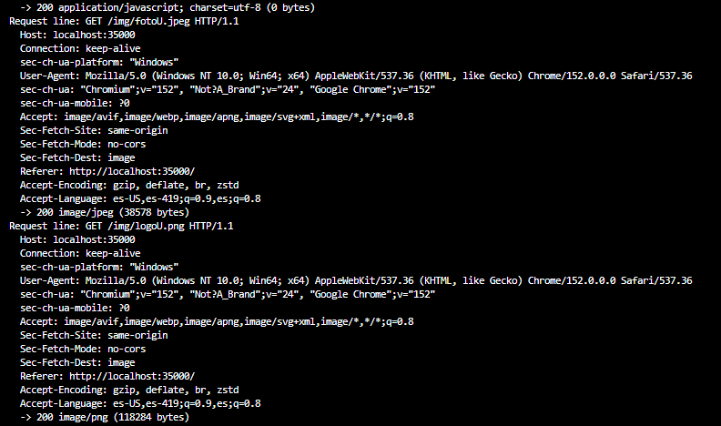
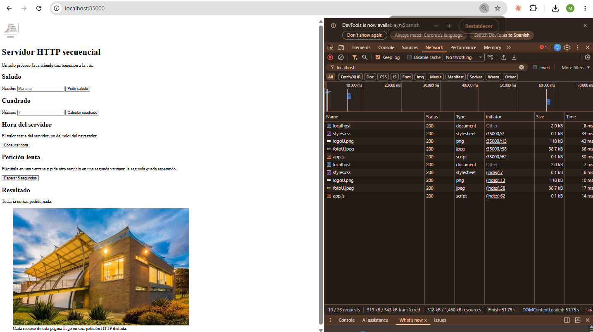
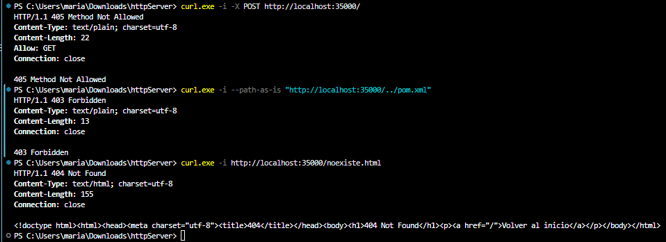
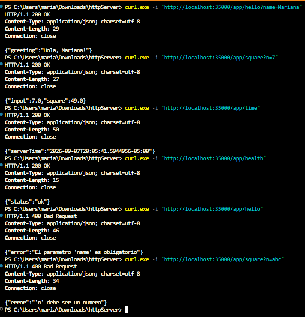
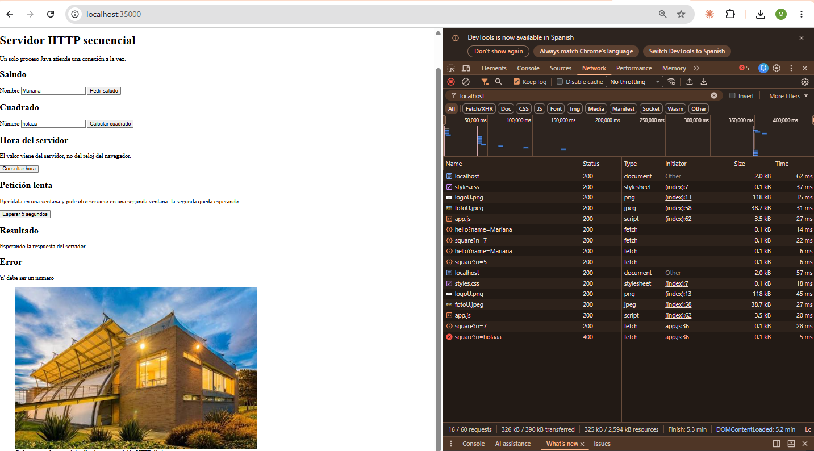

# Sequential HTTP Server — Networking Lab, Part 2
## Mariana Malagón Tochoy

## Lab summary

Extend a socket-based Java server into a small sequential web application that serves
HTML, JavaScript and images, exposes a few hardcoded service URLs, and runs on a single
AWS EC2 instance.

The server is deliberately limited: it handles one connection at a time. The point of the
laboratory is to build a correct, observable baseline and understand where requests wait,
before introducing concurrency or distribution. Asynchronous JavaScript keeps the browser
responsive, but it does not make the server concurrent; moving to EC2 changes where the
process runs, but one instance is still one capacity limit.


---

## Progress by lab section

### 1. Purpose and boundaries

**Scope.** Serve static resources with correct response metadata, recognise a small set of
hardcoded URLs that produce dynamic responses, and run the same application on one EC2
instance.

**Out of scope.** Threads, concurrent requests, thread pools, queues, load balancers,
autoscaling, containers, databases, authentication and production security. The server
processes one connection at a time.

**Prediction recorded before implementing (revisited in section 6.2).** While one user is
running a slow request, a second user's request will not be answered until the first one
finishes, because the server accepts a new connection only after closing the previous one.

---

### 2. Starting point: the minimal server

#### 2.1 Baseline verification

The server prints every line it receives, so the request line and headers sent by the
browser are visible in the console. A single page load produces more than one request:
besides the page itself, the browser asks for the favicon, and it would ask separately for
every script and image the page references.

The response is a status line, a content-type header, a blank line, and the body. The
blank line is what tells the client where the headers end.


#### 2.2 Accept multiple sequential requests

The connection loop was changed so the process keeps accepting connections after
completing each response. The listening socket stays open for the lifetime of the
process; the client socket and its streams are closed after every response, using
try-with-resources so they are released even when the request fails.

Each connection is handled completely before the next one begins. This is
**repetition, not concurrency**: there is a single thread of execution, and a second
connection waits in the operating system's accept queue until the current one is
done.

The server log makes this visible. Requests never interleave — the headers of one
request are always fully consumed and answered before the next request line appears:
Three page reloads produced fifteen consecutive requests answered by the same running
process, without restarting it. This also satisfies the "repeated requests" row of the
section 6.1 test matrix.




---

### 3. Serve HTML, JavaScript and images

The home page, the stylesheet, the client script and both images are now real files
under `src/main/resources/public`. The server reads every resource as bytes and
announces its content type from the file extension, so text and binary resources
follow one response path.

A single page request produces five separate HTTP requests: the browser reads the
HTML, discovers the references to the stylesheet, the script and the images, and
asks for each one individually.

| Resource | Status | Content type |
|---|---|---|
| `index.html` | 200 | `text/html; charset=utf-8` |
| `styles.css` | 200 | `text/css; charset=utf-8` |
| `app.js` | 200 | `application/javascript; charset=utf-8` |
| `logoU.png` | 200 | `image/png` |
| `fotoU.jpeg` | 200 | `image/jpeg` |



Content length is computed from the byte array rather than from the number of
characters. This matters because a single accented character takes two bytes in
UTF-8: counting characters would announce a size the client never receives, and the
browser would either truncate the body or wait for bytes that never arrive.

#### Controlled error responses

Requests that cannot be served produce an explicit status instead of a generic
answer:



Only `GET` is accepted for this laboratory, and a rejected method carries an `Allow`
header so the client knows what the server does support.

The traversal attempt is rejected before the file system is touched. The path is
URL-decoded first, so an attack written as `%2e%2e` cannot slip past the check, and
`pom.xml` is never disclosed. Backslashes and null bytes are rejected for the same
reason: the application is developed on Windows and deployed on Linux, and both
separators must be blocked to behave identically on either host.


---

### 4. Hardcoded service URLs

Four service paths are recognised with explicit conditions on the request path. There
is no routing framework, no annotations and no dependency injection: the mechanism
that selects behaviour stays visible, which is what this section of the lab is meant
to expose. Any path that is not one of these four is treated as a static resource.

| Path | Input | Success | Error |
|---|---|---|---|
| `/app/hello` | `name` in the query string | `200` with a JSON greeting | `400` when `name` is missing |
| `/app/square` | `n` in the query string | `200` with the input and its square | `400` when `n` is missing or not a number |
| `/app/time` | none | `200` with the current server time | — |
| `/app/health` | none | `200` with a status flag | — |

All four return `application/json`. None of them stores anything between requests:
every response is computed from the current request alone.



**Validation.** Query parameters are split on `&` and `=` before being URL-decoded,
not after: decoding first would turn a `%26` inside a value into a real separator and
split the parameter in the wrong place. A missing or non-numeric parameter produces a
client-error status rather than a successful response carrying an error message.

**Escaping.** User input is never inserted into JSON as-is. A name containing a quote
would close the string early and break the response, so quotes, backslashes, control
characters and angle brackets are escaped before the value is embedded.

The server time is returned in ISO-8601 with its offset, so the value is clearly
produced by the server rather than read from the browser clock.
---

### 5. Asynchronous browser client

The home page is the client interface. Every action is handled by `app.js`, which
builds the service URL, sends the request with the browser's asynchronous request API,
and updates only the relevant part of the page. The document is never reloaded: in the
network view the page, the stylesheet, the script and the images are requested once,
while each button click adds a single `fetch` entry.

**Interface.** A text field and an action for the greeting, a numeric field and an
action for the square, an action for the server time, a result area, and a separate
error area. Both areas can hold content at the same time, so an invalid request does
not erase the last successful result.


**Handling the three outcomes.** The client distinguishes a network failure from a
valid HTTP error response from a successful one, because they need different messages:

- The request never reaches a server — no HTTP response exists — and the user is told
  the server could not be contacted.
- The request completes but the status indicates an error. This case needs an explicit
  check: `fetch` treats a `400` as a completed request and does not raise, so reading
  the body without checking the status first would display `undefined` instead of the
  problem. The status is verified before the body is interpreted, and the `error`
  field returned by the service is shown as the message.
- The request succeeds and the JSON values update the result area.

**Loading state.** Buttons are disabled and the result area announces that a response
is pending, so the interface visibly reacts while the request is in flight. The state
is always restored, including when the request fails.

**Input validation happens twice.** Empty fields are caught in the browser before any
request is sent, and the server independently rejects missing or non-numeric
parameters. Client-side checks are a convenience, not a guarantee: a request can reach
the server without passing through the page at all, so the service validates on its
own.



Values are URL-encoded before being placed in the query string, which is the
counterpart of the decoding performed by the server. Responses are written into the
page as text rather than as markup, so a value coming back from the server is never
interpreted as HTML.

---

### 6. Integration and testing

**Pending.** Functional test matrix and the two-window experiment that shows the second
request waiting for the first one to finish.

---

### 7. Deployment to AWS EC2

**Instance launched.** One `t3.micro` Linux instance is running in `us-east-1`, in the
default VPC, with a descriptive name tag.

Still pending: producing a deployable artifact, making the listening port configurable,
adding the security-group inbound rule for the application port, installing the Java
runtime, transferring the artifact, and running it as a managed background service.

**Evidence:** `docs/…` — EC2 console showing the running instance. Account identifier and
user name redacted.

---

### 8. Final validation and reflection

**Pending.** Acceptance checklist and answers to the eight discussion questions.

---

### 9. Deliverables

#### 9.1 Repository

Public GitHub repository using Maven, with the conventional source layout and small,
meaningful commits showing the evolution from the minimal server onward.
.
├── pom.xml
├── README.md
├── .gitignore
└── src
└── main
└── java/co/edu/escuelaing/httpserver/httpserver/
├── HttpServer.java # connection loop, request parsing, responses
├── EchoServer.java # socket exercise: returns the message received
├── EchoClient.java # socket exercise: sends messages from the keyboard
├── ReadURL.java # prints the components of a URL
└── URLReader.java # reads a page and its HTTP response headers

A test directory is not present yet; automated tests are still to be written.

#### 9.3 .gitignore

Excludes Maven build output, compiled files, IDE configuration, operating-system metadata,
logs, environment files, private keys and local cloud configuration. The repository history
was inspected to confirm that none of these was ever committed.

---

## Prerequisites

- Java 21 (JDK)
- Apache Maven 3.9 or later
- A web browser with developer tools

```bash
java -version
mvn -version
```

---

## Preliminary exercises from part 1

| Class | What it does | Evidence |
|---|---|---|
| `ReadURL` | Prints protocol, authority, host, port, path, query and file of a URL | `docs/…` |
| `URLReader` | Reads a remote page and prints its HTTP response headers | `docs/…` |
| `EchoServer` / `EchoClient` | Echo protocol over raw TCP sockets | `docs/…` |

```bash
java -cp target/classes co.edu.escuelaing.httpserver.httpserver.ReadURL
java -cp target/classes co.edu.escuelaing.httpserver.httpserver.URLReader
java -cp target/classes co.edu.escuelaing.httpserver.httpserver.EchoServer
java -cp target/classes co.edu.escuelaing.httpserver.httpserver.EchoClient
```

---

## Known limitations

- The server is **sequential**: one connection at a time. A slow request blocks every
  other client.
- The HTML page is embedded in the Java source instead of being served from a file.
- Every response is announced as HTML, including the JSON one.
- No content length is sent.
- No static resources, images or external scripts are served.
- Only one dynamic path is recognised, and it returns the raw query string rather than a
  parsed parameter.
- Unsupported methods and missing resources are not distinguished from a normal response.
- This is a teaching exercise, **not a production-ready HTTP server**.

---
